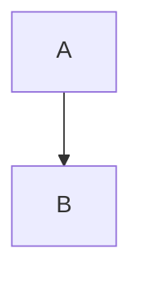

# Slidev Skill

## Slide Separators

Use `---` with newlines to separate slides:

```markdown
# Slide 1

Content here

---

# Slide 2
```

## Frontmatter

First block is headmatter (whole deck), others are per-slide:

```markdown
---
theme: seriph
title: My Presentation
---

# Slide 1

---

layout: center
background: /bg.png
class: text-white

---

# Slide 2
```

Common: `theme`, `title`, `layout`, `background`, `class`, `src` (import external markdown)

## Code Blocks

Fenced code with language ID. Slidev uses Shiki highlighting:

````markdown
```ts
console.log('Hello')
```
````

Features: line numbers, line highlighting `{1,3-4}`, code groups, TwoSlash

## Notes

Presenter notes via HTML comments at slide end:

```markdown
# Title

Content

<!-- Note for presenter -->
```

## MDC Syntax

Apply styles inline:

```markdown
:div[class="p-4"]

# Hello

:img{src="/img.png"}
```

## Diagrams

Mermaid:

````markdown

````

## LaTeX

Inline: `$E=mc^2$`, block: `$$...$$`

## Built-in Layouts

`cover`, `center`, `default`, `intro`, `fact`, `full`

## Commands

```bash
npx slidev              # Start interactive mode (select file)
npx slidev slides.md     # Run specific markdown file
npx slidev --open        # Auto-open in browser
npx slidev export        # Export to PDF
npx slidev build         # Production build
```

## File Structure

```
slides.md      # Entry
pages/         # External slides
components/    # Vue components
public/        # Assets
vite.config.ts # Config
```
