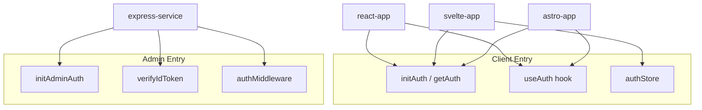

# firebase-auth Package Plan

## Architecture Overview

Firebase Auth uses two distinct SDKs with different runtimes. The package will expose them via separate entry points to avoid bundling server code in clients and vice versa.



## Package Structure

```
packages/firebase-auth/
├── package.json          # Exports: /client, /client/react, /client/svelte, /admin
├── tsconfig.json
├── .env.sample
├── src/
│   ├── client/
│   │   ├── index.ts      # initAuth, getAuth, config from env
│   │   ├── react.ts      # useAuth hook
│   │   └── svelte.ts     # authStore (writable/derived)
│   ├── admin/
│   │   └── index.ts      # initAdminAuth, verifyIdToken, authMiddleware
│   └── types.ts         # Shared types (User, AuthConfig)
└── README.llm.md
```

## Entry Points and Exports

| Export                        | Consumer                  | Purpose                                       |
| ----------------------------- | ------------------------- | --------------------------------------------- |
| `firebase-auth/client`        | React, Svelte, Astro      | Core client init, getAuth, config             |
| `firebase-auth/client/react`  | React, Astro (with React) | `useAuth()` hook                              |
| `firebase-auth/client/svelte` | Svelte                    | `authStore` reactive store                    |
| `firebase-auth/admin`         | Express                   | Admin init, `verifyIdToken`, `authMiddleware` |

## Environment Variables

**Client (web apps)** - exposed via `VITE_` (React/Svelte) or `PUBLIC_` (Astro):

| Variable                      | Required | Description                       |
| ----------------------------- | -------- | --------------------------------- |
| `VITE_FIREBASE_API_KEY`       | Yes      | Firebase API key                  |
| `VITE_FIREBASE_AUTH_DOMAIN`   | Yes      | e.g. `project-id.firebaseapp.com` |
| `VITE_FIREBASE_PROJECT_ID`    | Yes      | Firebase project ID               |
| `VITE_FIREBASE_APP_ID`        | Yes      | Firebase app ID                   |
| `VITE_FIREBASE_APP_ID`        | Yes      | Firebase app ID                   |
| `VITE_FIREBASE_EMULATOR_HOST` | No       | Optional emulator host for auth   |

**Server (Express)**:

| Variable                         | Required | Description                  |
| -------------------------------- | -------- | ---------------------------- |
| `FIREBASE_PROJECT_ID`            | Yes      | Firebase project ID          |
| `GOOGLE_APPLICATION_CREDENTIALS` | Yes      | Path to service account JSON |
| `FIREBASE_AUTH_EMULATOR_HOST`    | No       | Optional emulator host       |

Or `FIREBASE_SERVICE_ACCOUNT_JSON` base64-encoded JSON for serverless deployments.

## Key Implementation Details

### Client (`src/client/index.ts`)

- `getFirebaseConfig()` - reads from `import.meta.env` (VITE* or PUBLIC*), with optional override
- `initAuth(app?)` - initializes Firebase app if needed, returns `Auth` instance
- Re-exports `getAuth`, `signInWithEmailAndPassword`, `signOut`, `onAuthStateChanged`, etc. from `firebase/auth`

### React (`src/client/react.ts`)

- `useAuth()` - returns `{ user, loading, error, signIn, signOut }` using `useState` + `useEffect` for `onAuthStateChanged`
- Peer dependency: `react`

### Svelte (`src/client/svelte.ts`)

- `authStore` - Svelte store (derived from `onAuthStateChanged` callback)
- `authLoading` - derived store for loading state
- Peer dependency: `svelte`

### Admin (`src/admin/index.ts`)

- `initAdminAuth()` - initializes Firebase Admin with `firebase-admin/auth`, returns `Auth` instance
- `verifyIdToken(token)` - verifies Bearer token from `Authorization` header
- `authMiddleware` - Express middleware that extracts Bearer token, verifies it, attaches `req.user` (decoded claims)

## Dependencies

- **firebase** (client) - `^11.x` (modular SDK)
- **firebase-admin** (admin) - `^13.x`
- **react** - peer (for `/client/react`)
- **svelte** - peer (for `/client/svelte`)

## Consumer Integration

**React app** - add to [apps/react-app/package.json](apps/react-app/package.json):

```json
"firebase-auth": "workspace:*"
```

Add to `.env` (see [packages/firebase-auth/.env.sample](packages/firebase-auth/.env.sample)):

```
VITE_FIREBASE_API_KEY=...
VITE_FIREBASE_AUTH_DOMAIN=...
VITE_FIREBASE_PROJECT_ID=...
VITE_FIREBASE_APP_ID=...
```

Then in app entry or layout:

```ts
import { initAuth } from 'firebase-auth/client'
import { useAuth } from 'firebase-auth/client/react'

initAuth() // call once at app init
// use useAuth() in components
```

**Express** - add dependency and middleware:

```ts
import { initAdminAuth, authMiddleware } from 'firebase-auth/admin'

initAdminAuth()
app.use('/api/protected', authMiddleware, (req, res) => { ... })
```

Full setup instructions live in [packages/firebase-auth/README.md](packages/firebase-auth/README.md).

## Documentation for Ease of Use

Documentation will be layered so developers can get started quickly and find details when needed.

### README.md (user-facing)

Suggested structure:

1. **Quick start** - 3-step setup: install, add env, call init
2. **Prerequisites** - link to [Firebase Console](https://console.firebase.google.com) (create project, enable Auth, get config)
3. **Environment variables** - table: var name | used in | where to find
4. **React** - install, env vars, `initAuth()` + `useAuth()` example
5. **Svelte** - install, env vars, `initAuth()` + `authStore` example
6. **Astro** - install, env vars (PUBLIC), usage with React components
7. **Express** - install, env vars, `initAdminAuth()` + `authMiddleware` example
8. **Emulator** - set `*_EMULATOR_HOST` for local testing
9. **Protected routes** - example guarding routes by auth state
10. **Sending tokens to API** - `user.getIdToken()` and `Authorization: Bearer <token>`
11. **Troubleshooting** - missing env, CORS, emulator not connecting

### .env.sample (inline comments)

Each variable documented with: purpose, where to get it (e.g. "Firebase Console > Project Settings"), and example value.

### JSDoc in source

- All exported functions: `@param`, `@returns`, `@example` with minimal usage
- Types/interfaces: brief description of when to use

### README.llm.md (agent-facing)

- Module layout, exports, relationships (per AGENTS.md)
- Updated when adding/changing modules

## Files to Create

1. [packages/firebase-auth/package.json](packages/firebase-auth/package.json) - package config, exports, deps
2. [packages/firebase-auth/tsconfig.json](packages/firebase-auth/tsconfig.json) - TypeScript config (mirror package1)
3. [packages/firebase-auth/.env.sample](packages/firebase-auth/.env.sample) - env vars template with inline comments
4. [packages/firebase-auth/README.md](packages/firebase-auth/README.md) - user-facing docs (quick start, setup, troubleshooting)
5. [packages/firebase-auth/src/client/index.ts](packages/firebase-auth/src/client/index.ts) - client init (JSDoc)
6. [packages/firebase-auth/src/client/react.ts](packages/firebase-auth/src/client/react.ts) - useAuth hook (JSDoc)
7. [packages/firebase-auth/src/client/svelte.ts](packages/firebase-auth/src/client/svelte.ts) - auth store (JSDoc)
8. [packages/firebase-auth/src/admin/index.ts](packages/firebase-auth/src/admin/index.ts) - admin init, middleware (JSDoc)
9. [packages/firebase-auth/src/types.ts](packages/firebase-auth/src/types.ts) - shared types
10. [packages/firebase-auth/README.llm.md](packages/firebase-auth/README.llm.md) - module docs for agents
11. ESLint config, vitest config, knip config (copy from package1)

## Validation

- Run `pnpm install` to link workspace
- `pnpm build` in firebase-auth
- `pnpm test` in firebase-auth (mock Firebase in tests)
- `pnpm lint` in firebase-auth
- Add firebase-auth to one app (e.g. react-app) and one service (express-service) as smoke test; verify build passes

## Notes

- Firebase config (apiKey, etc.) is safe to expose in client bundles per [Firebase docs](https://firebase.google.com/docs/web/learn-more#config-object)
- Service account credentials must never be exposed to client; admin package is server-only
- Emulator support via env vars enables local testing without live Firebase project
